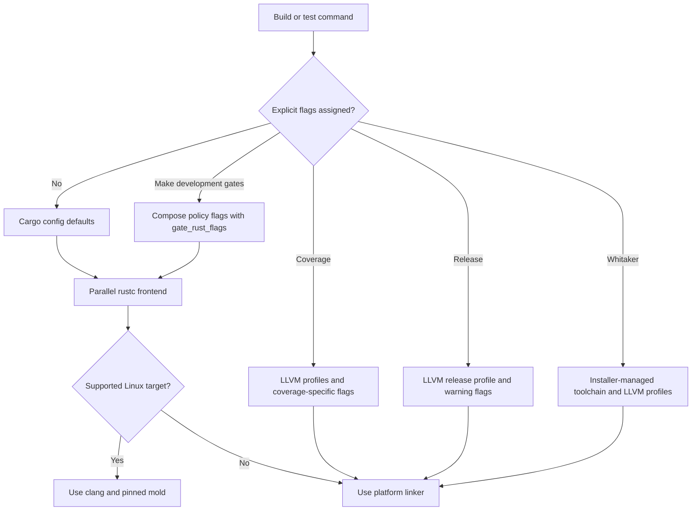

# Mapsplice developers' guide

This guide is for maintainers and contributors changing `mapsplice` internals,
library APIs, command-line behaviour, tests, or build tooling.

## Spelling policy

Run `make spelling` to enforce en-GB-oxendict prose spelling. The gate
regenerates `typos.toml` on every run from the live shared estate dictionary
and the `typos.local.toml` overlay, so a word added to the shared dictionary
needs no change here. Because the dictionary is live, `typos.toml` is never
drift checked in continuous integration. Add narrow repository-specific
identifier, API, proper-name, or fixture exceptions to `typos.local.toml`;
hand-editing `typos.toml` is not supported and any edits are overwritten on the
next run.

`TYPOS_CONFIG_BUILDER_VERSION` in the `Makefile` pins the
`typos-config-builder` release the gate runs (currently `v0.1.3`). Raise it
together with the regenerated `typos.toml`, never on its own.

## 1. Normative references

The source-of-truth documents for internal changes are:

- [Design document](mapsplice-design.md) for architecture boundaries and
  roadmap grammar.
- [Accepted decision record and implementation plan](execplans/initial-tool.md)
  for the initial tool decisions.
- [Roadmap](roadmap.md) for planned structural work.
- [Contributing guide](contributing.md) for local prerequisites and quality
  gates.
- [Documentation style guide](documentation-style-guide.md) for Markdown
  conventions.

## 2. Architecture boundaries

`mapsplice` is split into a narrow binary adapter, a library application
boundary, and roadmap domain modules:

- `src/main.rs` initializes tracing, calls `mapsplice::run_from_args`, writes
  roadmap output to standard output, and reports diagnostics on standard error.
- `src/lib.rs` owns the application workflow: parse CLI input, read the target
  and optional fragment, translate CLI commands into roadmap operations, render
  the result, and perform in-place writes.
- `src/cli.rs` is the command-line and `ortho-config` adapter. It exposes
  `CommandKind`, `GlobalOptions`, and `CliRequest`.
- `src/roadmap` owns domain parsing, mutation, renumbering, and rendering.
  `RoadmapOperation` is the domain command type; CLI command enums must be
  translated before entering `roadmap::ops`.
- The private `render::inline` module, implemented in
  `src/roadmap/render_inline.rs`, renders supported inline Markdown AST nodes
  and reports unsupported nodes as roadmap errors.
- The private `anchor::deserialize` module, implemented in
  `src/roadmap/anchor_deserialize.rs`, validates serialized phase, step, task,
  and sub-task numbers through their domain constructors.
- `src/fs.rs` is the capability-oriented filesystem adapter. Filesystem
  failures must surface as `MapspliceError::Io`, not roadmap validation errors.

The roadmap model stores Markdown content in `MarkdownNodes`, a value object
that keeps parser nodes behind the parse/render boundary. New roadmap fields
should prefer typed domain values over raw parser or adapter types.

## 3. Public library APIs

The library API is intentionally small:

- `run_from_args` executes the complete CLI workflow from command-line
  arguments and returns a `RunOutcome`.
- `run_request` executes an already parsed `CliRequest`.
- `parse_roadmap` and `parse_fragment` parse supported roadmap Markdown into
  typed domain structures.
- `parse_anchor` validates canonical positive anchors such as `8`, `8.2`,
  `8.2.3`, and `8.2.3.1`.
- `metrics_snapshot` returns bounded process-local counters for failures,
  in-place rewrites, dependency rewrites, and source-preservation outcomes.

Public APIs must return typed `MapspliceError` variants. Opaque reports belong
only at external process boundaries.

## 4. Configuration behaviour

Configuration behaviour has two current owners:

- `src/cli_config.rs` owns global `in_place` discovery and parsing. It reads
  `$XDG_CONFIG_HOME/mapsplice/config.toml` and local `./.mapsplice.toml`,
  applies `MAPSPLICE_IN_PLACE`, then lets `--in-place` / `-i` force `true`.
- `src/cli.rs::InsertConfig` owns the insert command's `after` option. It
  removes Clap's implicit `false` value when `--after` is absent, then merges
  defaults through `ortho_config::load_and_merge_subcommand_for`.
- Required values such as target paths, anchors, and fragment paths remain
  command-line arguments.

Future optional configuration settings must document which loader owns their
discovery path. Add or update `tests/roadmap_config.rs` coverage for every
source and precedence claim before changing the users' guide.

Configuration tests use the shared `ProcessState` fixture in
`tests/support/config.rs`. `set_env`, `remove_env`, and `enter_dir` configure
changes that take effect only inside `run`; `Workspace::enter_root` selects the
workspace directory through `enter_dir`. `run` holds a shared lock while the
closure executes, then restores the environment and working directory.

## 5. Observability

Tracing spans exist at the process, filesystem, parse, splice, render, and
rewrite boundaries. Stable fields include operation, anchor, path, byte count,
phase count, and error class. Logs are disabled unless a subscriber is enabled
through standard tracing environment configuration.

`src/observability.rs` keeps bounded process-local counters. These are not
durable metrics; they exist to make failure and rewrite counts inspectable in
tests and embeddings without adding a metrics backend.

`MetricsSnapshot` reports `preserved_source_renders`,
`preserved_source_invalidations`, and `canonical_fallbacks` for the aggregate
source-preservation outcomes. It also reports the reason-specific counters
`invalidations_renumber`, `invalidations_dependency_rewrite`,
`invalidations_child_mutation`, `canonical_fallbacks_unstable_list_marker`, and
`canonical_fallbacks_unstable_code_fence`. All counters are atomic and
process-local; they are snapshots for diagnostics and tests, not durable
telemetry.

The closed `PreservationInvalidationReason` set is `Renumber`,
`DependencyRewrite`, and `ChildMutation`. The closed `CanonicalFallbackReason`
set is `UnstableListMarker` and `UnstableCodeFence`. Invalidation is recorded
at task or sub-task mutation points in `src/roadmap/model_task_entry.rs` and
`src/roadmap/ops/rewrite.rs`. Preservation and canonical-fallback outcomes are
recorded at the source-preservation rendering decision in
`src/roadmap/render_preservation.rs`.

## 6. Verification layers

The test suite has four layers:

- `rstest` unit tests cover parser, splice, configuration, and error behaviour.
- `rstest-bdd` scenarios exercise the compiled binary through user workflows.
- `proptest` properties cover canonical anchor round-trips and generated
  dependency rewrites across multiple insertion points.
- `trybuild` and `insta` cover compile-time API compatibility and stable CLI
  help output.

Property tests should construct valid inputs rather than filter invalid data
after generation. Any shrunk failure should be promoted to a named regression
test when it captures a real bug.

Task-list source preservation has a separate internal boundary from ordinary
Markdown-node source preservation. `src/roadmap/source_preservation.rs`
extracts source spans, while `StepSection::task_list_source` stores the exact
source for the first parsed task list in an unchanged step. Render validates
the task model before reusing that source, and mutation or dependency-rewrite
code must call `StepSection::clear_task_list_source` whenever the task list
itself changes. Target parsing also captures each task and addendum sub-task's
list-item source in `TaskEntry::original_source` and
`SubTaskEntry::original_source`; fragment items do not receive preserved source.
`src/roadmap/model_task_entry.rs` owns the per-item accessors and structural
invalidation, while `src/roadmap/render_task.rs` reuses preserved source before
falling back to canonical rendering. Clear an item only when its own number or
text changes, when dependency-related content changes, or when a structural
descendant changes. Preserve the source only when it is formatter-stable;
otherwise use the canonical fallback. Unchanged task and sub-task chunks remain
byte-identical, including continuation indentation. Invalidated or
formatter-unstable items use canonical rendering with the two-space
continuation convention.

Dependency-reference rewrite coverage is layered around the internal
`classify_dependency_reference` predicate in
`src/roadmap/ops/dependency_text.rs`. Unit tests cover the classifier branches,
behavioural tests cover unresolved valid references, invalid version-like
tokens, mapped rewrites, and scoped preservation through the compiled binary.
Property tests cover generated invalid dependency tokens, incidental numeric
text, scoped reference preservation beside mapped `Requires` references, and
append preservation across generated task-list shapes.

## 7. Local tooling

Local builds use the pinned nightly toolchain in
[`../rust-toolchain.toml`](../rust-toolchain.toml) and build settings in
[`../.cargo/config.toml`](../.cargo/config.toml). The development default uses
LLVM code generation, the parallel rustc frontend, and, on supported Linux
targets, `clang` plus pinned `mold`. Cargo discovers these defaults from
`.cargo/config.toml`; Make restates the flags on gate recipes that set
`RUSTFLAGS`. Run `make install-build-tools` and `make check-build-tools` before
development builds. The pinned toolchain includes rustfmt, Clippy,
rust-analyzer, and LLVM tools. Coverage, release, and Whitaker use explicit
non-development routes; see [the contributing guide](contributing.md) for local
setup.

On supported Linux hosts, `make check-build-tools` checks that `clang` and
`mold` are available on `PATH`, and that `ld.mold` reports version 2.41.0; the
Clang wrapper resolves that linker from `PATH`. The AArch64 route uses a
dedicated wrapper to pass `--target=aarch64-unknown-linux-gnu` to Clang.
Cross-linking still requires a compatible AArch64 linker sysroot and supporting
tools on the host; the preflight does not install or supply them.

Make's compiler and linker routing also accounts for Cargo target selection.
The Make recipes inspect `--target`, `CARGO_BUILD_TARGET`, and
`--config build.target` selectors. The `scripts/resolve-cargo-build-target.py`
helper resolves inherited `build.target` values from `CARGO_HOME` and ancestor
`.cargo/config` or `.cargo/config.toml` files, with nearer project
configuration overriding earlier values. A missing target leaves the current
selection unchanged. Ambiguous filenames, unreadable or malformed files, empty
targets, and other unsupported target values fail closed so Make cannot
silently choose the wrong linker route.



*Figure 1. Compiler flag routing for Mapsplice. Bare development commands use
Cargo defaults; Make development gates compose warning and policy flags with
the parallel frontend flags. The supported Linux targets are
`x86_64-unknown-linux-gnu` and `aarch64-unknown-linux-gnu`, which use `clang`
and pinned `mold`; other targets use their platform linker. Coverage, release,
and Whitaker use LLVM without the development frontend or `mold` flags. Release
uses the pinned nightly Cargo, while Whitaker uses its installer-managed
toolchain.*

Make also filters development-owned arguments from inherited
`CARGO_ENCODED_RUSTFLAGS` before composing each route, preserving other caller
policy flags. Encoded flags take precedence over `RUSTFLAGS`, so both flag
sources must follow the selected route.

Whitaker receives explicit LLVM development and test profile overrides without
the repository's development frontend or linker flags. Keep
`CARGO_UNSTABLE_CODEGEN_BACKEND=true` on this route: Dylint may build a driver
from a temporary Cargo project outside the repository, where Cargo cannot
discover the root `.cargo/config.toml` that enables the unstable profile
setting. The environment variable opts that nested invocation into the Cargo
setting; it does not select Cranelift. On a cold runner, Dylint can still build
its per-toolchain driver as part of that runtime bootstrap. This is separate
from the installer's prohibited source fallback: Whitaker's suite library and
Dylint tool archive must come from published assets.

### Cranelift exception

Cranelift is excluded from the development default. On the pinned
`nightly-2026-03-26`, the `catch_unwind` probe failed and a spawned-thread
panic aborted the test process; the explicit LLVM route passed the full suite
(293/293). See the
[investigation](debugging/debugging-plan-2026-09-30-mapsplice-cranelift-unwind.md).
Review this exception under
[issue #115](https://github.com/leynos/mapsplice/issues/115) on 2027-04-01.

Run these gates before committing Rust changes:

```bash
make check-fmt
make test
make typecheck
make lint
```

Run these gates for Markdown changes:

```bash
MARKDOWN_PATHS='docs/users-guide.md docs/developers-guide.md' make markdownfmt
MARKDOWN_PATHS='docs/users-guide.md docs/developers-guide.md' make markdownlint-paths
make markdownlint
make nixie
```

`MARKDOWN_PATHS` is a whitespace-separated list of existing Markdown paths to
format or lint. Use `make markdownfmt` for narrow Markdown maintenance;
`make fmt` remains repository-wide and can reformat unrelated Markdown files.
The `make fmt` and `make check-fmt` targets select tracked and unignored
untracked Markdown files directly through mdtablefix. The two indented-code
golden fixtures that are not formatter-stable have `.txt` extensions; their
contents remain byte-identical to the authored test data.

`make nixie` validates Mermaid diagrams in tracked Markdown files through the
CI-installed `merman-cli` renderer. The target runs one Markdown file at a time
and defaults both `NIXIE_MAX_CONCURRENCY` and `NIXIE_RENDERER_THREADS` to `1`,
so the default command is the serial comparison path used to prove CI
determinism. Contributors can still override the renderer job cap with, for
example, `NIXIE_MAX_CONCURRENCY=2 make nixie` when investigating local
performance, but the serial default is the gate that must pass before
committing Markdown changes.

## The build standard

Development, test, lint, and typecheck builds use the parallel `rustc` frontend
(`-Zthreads=8`) and, on Linux, the `mold` linker (`-Clink-arg=-fuse-ld=mold`).
These are defaults in `.cargo/config.toml`, which Cargo discovers on its own,
so a bare `cargo build` gets them. `mold` ships for Linux only, so the linker
flag lives in a Linux-only table and macOS and Windows keep their platform
linker. Cargo selects one `rustflags` source rather than merging them, so every
source repeats the same flags apart from the linker.

An assigned `RUSTFLAGS` replaces the configuration's flags, while Cargo uses
`CARGO_ENCODED_RUSTFLAGS` in preference when it is set. The Makefile therefore
assigns both sources: it builds `RUSTFLAGS` from `RUST_FLAGS` and the selected
route flags, and filters development-owned options from inherited
`CARGO_ENCODED_RUSTFLAGS` before appending those route flags. This preserves
other caller-encoded policy while removing `-Zthreads=8`, the Cranelift backend
selector, and the `mold` linker argument from the inherited source. Coverage
assigns warnings-only `RUSTFLAGS` and uses LLVM profiling; release uses
`RUST_FLAGS` and the LLVM release profile. Both routes omit the development
frontend and `mold` flags. Cargo has no per-profile `rustflags`, so a direct
`cargo build --release` uses the discovered configuration unless an environment
flag source is assigned.

On Linux, install `mold` before building: the configuration names it, so a
build without it fails at link time. CI installs it through `setup-rust`'s
`install-mold` input. `tests/build_standard_contract.rs` holds the standard. It
reads the configuration sources, the commands `make -n` prints for each
development target on a Linux host and a macOS host (each keeping the caller's
own `RUSTFLAGS`) and for the release target (the coverage exclusion is checked
in the workflow steps) on a Linux host, and the `setup-rust` steps of the CI
workflows (each must pass `install-mold`), so a flag lost through a recipe or
workflow edit fails there. The decision is recorded in
[ADR 001](adr-001-rust-build-standard.md). The contract runs `make -n`, so a
direct `cargo test` needs GNU make on the `PATH`. It fails when `make` is
missing instead of skipping, so a missing tool cannot read as a pass.

### Cold-cache allowance for the trybuild tests

`.config/nextest.toml` keeps the 180 s per-test allowance that the coverage
action writes when a repository has no file of its own, and gives the
`compile_time` tests three times that. They run a nested Cargo that compiles
the whole dependency graph, and a pull request has no warm sccache directory
until the default branch has written one (`setup-rust` owns that directory and
only a push to the default branch writes it). Before that cache exists, the
nested build alone can exceed 180 s on a GitHub-hosted runner.

### Cranelift

Cranelift is currently excluded from development builds; LLVM is the
development default. Before the exclusion, the full suite was measured with
Cranelift on the pinned `nightly-2026-03-26` on 2026-09-28: all 290 nextest
tests and the doctests passed. This is historical evidence from before the
`catch_unwind` probe failed and a spawned-thread panic aborted the test process
on that toolchain. See the
[investigation](debugging/debugging-plan-2026-09-30-mapsplice-cranelift-unwind.md).
Coverage selects LLVM explicitly (`CARGO_PROFILE_DEV_CODEGEN_BACKEND=llvm`),
because instrumentation needs it, and release builds use the release profile,
which Cranelift does not affect. Before enabling Cranelift again, re-measure
the full suite and reconsider the exception based on the results.

## 8. Workflow pins and Dependabot

Dependabot owns the upgrade of GitHub Actions and reusable workflows, including
calls into `leynos/shared-actions`. Contract tests that assert a caller's exact
commit SHA create a lockstep dependency: every time Dependabot opens a bump PR,
the test fails until a human edits the pinned constant to match. That defeats
the purpose of automated dependency updates and turns a routine bump into a
manual chore.

Contract tests may still verify the *shape* of a reusable-workflow caller. They
must not verify the specific SHA value.

- Do assert the workflow references the correct reusable workflow path.
- Do assert the ref is pinned to a full 40-character commit SHA, not a
  mutable branch such as `main` or `rolling`.
- Do assert the expected `on:` triggers, least-privilege `permissions:`, and
  the inputs the caller relies on.
- Do not hard-code the current SHA value as an expected string. Match it with
  a pattern instead.
- Do not fail a test purely because Dependabot bumped the pinned SHA.

```python
import re

SHA_RE = re.compile(r"^[0-9a-f]{40}$")


def test_uses_pinned_full_sha(caller_step):
    ref = caller_step["uses"].split("@")[-1]
    assert SHA_RE.match(ref), f"expected a 40-hex commit SHA, got {ref!r}"
```

If a workflow's behaviour genuinely depends on a feature only present from a
particular commit onwards, express that as a comment or a changelog note, not
as a test assertion on the SHA string.

## 9. Coverage administration and readiness

CV-005 has separate static and administrative prerequisites. The offline
`make test-workflow-contracts` gate validates the actual workflow files. Its
workflow-shape fixtures modify copies for mutation testing; they cannot prove
that a GitHub environment exists or that a secret has the correct scope. Keep
the live contract strict when an administrative prerequisite is missing.

The sole publisher is `coverage-main.yml`, job `coverage-publisher`, which runs
on pushes to `main` and already declares `environment: codescene`. The owner
must verify that this environment is provisioned and protected before readiness
and merge. If its policy is missing or has drifted, repair it through the
trusted administrative process and perform a fresh read-back. Do not remove the
workflow declaration or rely on a workflow to create or repair administrative
protection. PR workflows remain secret-free and cannot upload to CodeScene or
write the persistent coverage baseline. If `CS_ACCESS_TOKEN` is unavailable,
the publisher emits a fixed GitHub Actions warning that coverage was not
published; the upload step remains guarded. This warning reports a skipped
upload and does not prove that the environment or token has been provisioned.

### Trusted owner checks

Run the read-only administrative verifier from an owner-reviewed checkout in a
trusted local session. Authenticate GitHub CLI as an authorized repository
owner or administrator with permission to read environments and deployment
policies. Keep those credentials outside PR workflows, logs, and committed
files. Review the verifier before executing it with administrative access;
executing arbitrary PR code with those credentials is not a readiness check.

```bash
python3 scripts/verify_codescene_environment.py --repo leynos/mapsplice
```

This command performs only GitHub API `GET` requests and exits non-zero when
the protection cannot be verified. It does not provision environments, read
secret values, upload coverage, or write a baseline. Its injected API client
and pure validation functions support offline tests without administrative
access; it is deliberately separate from `make test-workflow-contracts`.

The verifier must read the `codescene` environment and enumerate every
deployment branch policy. Require `protected_branches: false` and
`custom_branch_policies: true`, with exactly one policy whose `name` is `main`
and whose `type` is `branch`. Tags, additional branches, and wildcard patterns
are not permitted. Missing or unreadable state, malformed responses, incomplete
pagination, and policy drift must block readiness. HTTP 403 means access was
denied; HTTP 404 means the resource was not found or was concealed from the
current identity. Neither response proves protection.

Before readiness and again immediately before merge, the owner must complete
these actions and record non-secret evidence:

1. Verify that `codescene` exists and repair it through the trusted
   administrative process if needed. Then run a fresh policy read-back. Record
   the repository, authenticated identity, UTC time, inspected Git head, policy
   flags, complete pagination, and the sole permitted branch policy. A
   committed response snapshot is historical evidence, never a substitute for
   the live check.
2. Provision `CS_ACCESS_TOKEN` as an environment-scoped secret. Read its
   metadata through the environment secrets API and record only its name,
   scope, and creation/update timestamps. Never retrieve, print, or commit its
   value. Token existence does not establish the policy or project identity.
3. Remove obsolete repository-level or organization-level token exposure
   through an authorized owner action. Read back repository secret metadata and
   any applicable organization secret access configuration to establish that
   PR-accessible routes no longer expose `CS_ACCESS_TOKEN`. If either inventory
   is unreadable or incomplete, record an unresolved prerequisite; do not infer
   removal.
4. Confirm in the trusted CodeScene administrative interface that the token
   belongs to the intended project for `leynos/mapsplice` and that the project
   tracks this repository and the main coverage publication. Record the
   verified project identity and mapping without its token. Do not invent a
   project identifier or treat a fixture as confirmation.
5. Keep `jobs.coverage-publisher.environment: codescene` on the existing
   publisher and proceed only after authorized protection evidence is
   available. Preserve its action pins, compiler route, coverage parity,
   concurrency, permissions, token guard, and sole baseline writer. Rerun the
   strict live contract and the full workflow-contract gate.

Repeat the live policy and secret-scope checks at least weekly and after
changes to environment settings, deployment policies, secret scope, or
administrative access. Any drift blocks readiness and merge until the owner
repairs and re-verifies it. A read-back is a point-in-time observation, not an
atomic guarantee that settings cannot subsequently change.

### Evidence boundaries

- **Static validation:** Offline mocked API tests exercise verifier behaviour;
  workflow contracts enforce the checked-out YAML trust boundary. Record the
  exact head and any uncommitted patch identity with their actual results.
- **Administrative verification:** Fresh owner-authorized reads establish
  environment policy and secret metadata. Record missing evidence explicitly.
- **Hosted PR coverage:** An actual run on the current PR head measures the
  secret-free PR lane. Local tests do not prove that hosted measurement.
- **Protected main publication:** The first post-merge main run must enter
  the protected environment and demonstrate the sole publisher's baseline write
  and guarded upload to the verified CodeScene project. PR coverage does not
  prove that publication.

Merge remains blocked while the administrative prerequisites or required gates
are incomplete. CV-005 verification does not clear the separate approved Rust
environment-access `disallowed_methods` policy prerequisite or outstanding
review findings. PR review status is tracked separately from merge readiness.

The GitHub API references are:

- [Environments](https://docs.github.com/en/rest/deployments/environments)
- [Deployment branch policies](https://docs.github.com/en/rest/deployments/branch-policies)
- [Environment secret metadata](https://docs.github.com/en/rest/actions/secrets#get-an-environment-secret)

## Lint baseline

[`Cargo.toml`](../Cargo.toml) holds the package's Clippy, Rust, and rustdoc
lint levels. [`clippy.toml`](../clippy.toml) sets the complexity ceiling to 9,
the argument limit to 4, the line limit to 70, and the nesting limit to 4. The
selected estate baseline is Concordat revision
`902d034d9da8e7ca33a0d4032770519dd1609de2`; this repository also requires
`missing_assert_message`, `missing_docs_in_private_items`, and
`unsafe_code = "forbid"`. Fix findings in source. Any unavoidable exception
needs a narrow scope and a stated reason; do not use `#[allow]` to carry a
backlog.

This package has no Cargo workspace. If it gains one, put the authoritative
tables under `[workspace.lints.*]` and make every member inherit them with
`[lints] workspace = true`. Use the components in
[`rust-toolchain.toml`](../rust-toolchain.toml), including rustfmt and Clippy;
the build and verification routes also require their documented tools. Keep
environment access at an explicit CLI configuration boundary and inject an
environment reader into code that needs deterministic testing. The
`disallowed_methods` lint level is enabled, but an approved method list has not
yet been selected for this repository; it does not currently enforce the
environment-access rule.

The binding `make lint` documentation check runs
`cargo doc --workspace --no-deps` with
`RUSTDOCFLAGS='--cfg docsrs -D warnings'`. The doctest route uses the same
Rustdoc flags. This enables docs.rs-only documentation paths in both checks
while denying Rustdoc warnings.
